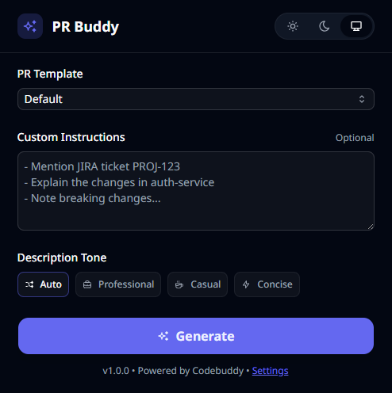
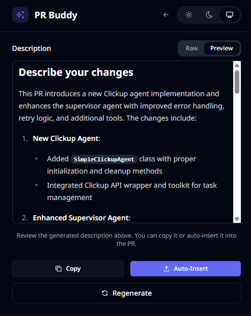
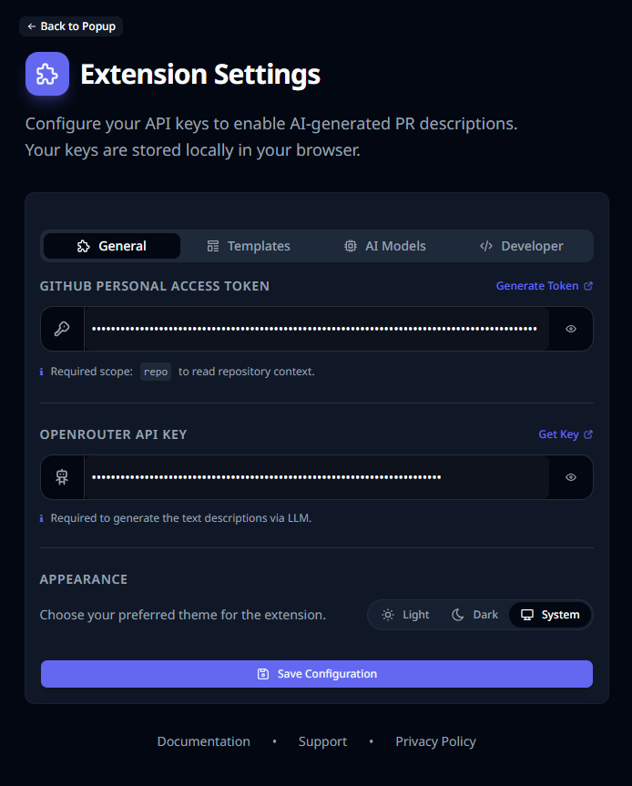

# PR Buddy

A Chrome extension that helps generate PR descriptions using AI.

> **⚠️ Note:** This extension currently works only on raised PRs.

## 📷 Screenshots

<p align="center">
  
  
  
</p>

## 📋 Requirements

To use this extension, you will need:

- **GitHub PAT (Personal Access Token)**: Required to fetch PR details and diffs.
- **OpenRouter API Key**: Required to generate descriptions using AI models.

These can be configured in the extension's settings page.

## 🚀 Quickstart

### Prerequisites

- Node.js `v20+` (LTS recommended)
- pnpm (`npm install -g pnpm`)

### Build & Install

```bash
# Install dependencies
pnpm install

# Build the extension
pnpm build
```

1. Open Chrome and navigate to `chrome://extensions`
2. Enable **Developer mode** (top right toggle)
3. Click **Load unpacked**
4. Select the `dist` folder from this project

The extension icon should now appear in your toolbar!

## 🔄 Steps to upgrade (manually)

1. Go to the [GitHub releases page](https://github.com/avirupdutta/pr-buddy/releases) for this repository.
2. Download the latest `dist.zip` file from the releases section.
3. Extract the contents of the zip file.
4. Replace the existing contents of your `dist` folder with the extracted files.
5. Open Chrome and navigate to `chrome://extensions`.
6. Find the PR Buddy extension and click the reload button (circular arrow icon).

## 🛠️ Development Setup

```bash
# Install dependencies
pnpm install

# Start dev server with hot reload
pnpm dev
```

Load the extension in Chrome (same steps as above, but select the `dist` folder while dev server is running).

### Available Scripts

| Command        | Description              |
| -------------- | ------------------------ |
| `pnpm dev`     | Start development server |
| `pnpm build`   | Build for production     |
| `pnpm lint`    | Run ESLint               |
| `pnpm preview` | Preview production build |

## 📄 License

Apache 2.0 - see [LICENSE](./LICENSE)
